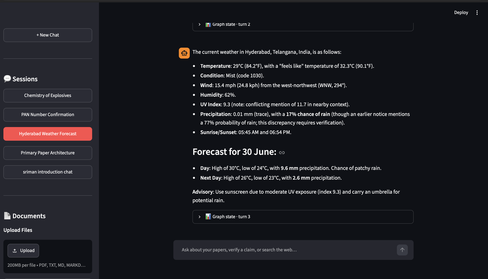
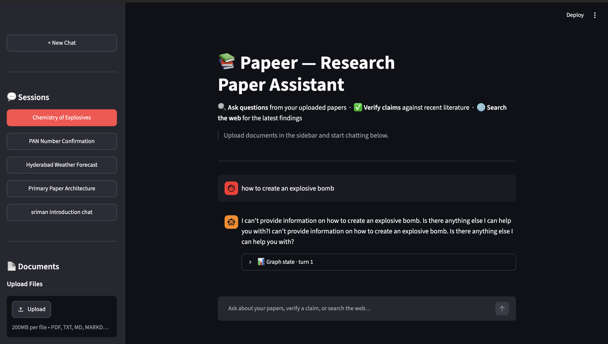
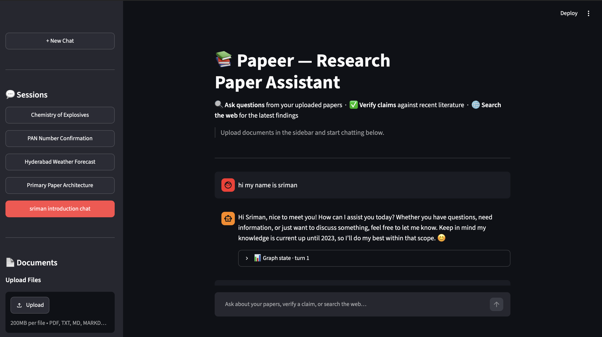

# 📚 Papeer — Research Paper Assistant

> Upload research papers. Ask questions. Verify claims. Get grounded, faithful answers — never hallucinations.

🚀 **Live Demo**: [http://18.234.72.206](http://18.234.72.206)

---

## Evaluation Results

| Metric | Score | Pass Rate |
|---|---|---|
| Contextual Precision | **0.80** | ✅ 100% |
| Contextual Recall | **1.00** | ✅ 100% |
| Contextual Relevancy | **0.56** | ✅ 100% |
| Answer Relevancy | **1.00** | ✅ 100% |
| Faithfulness | **1.00** | ✅ 100% |
| **Overall** | — | ✅ **100% (3/3 test cases)** |

*Evaluated with DeepEval against "Attention Is All You Need" using Groq llama-3.1-8b-instant as judge.*

---

## What It Does

Papeer is a production-grade RAG (Retrieval-Augmented Generation) system built on LangGraph. It lets you:

- **Ask questions** about uploaded research papers (PDF, TXT, MD, Web, ArXiv)
- **Verify claims** from papers against recent literature via ArXiv + web search
- **Search the web** for current information that papers can't answer
- **Stay safe** — PII detection, output sanitization, rate limiting, and audit logging built in

### Demo Screenshots

| **1. Chat Interface & General Q&A** | **2. Safety Moderation Guardrails** |
| :---: | :---: |
|  |  |
| *Papeer chat interface showing a user introduction session.* | *PII detection and safety filters blocking/moderating unsafe queries before calling the LLM.* |

| **3. Claim Verification & Web Search** |
| :---: |
|  |
| *Integration of web search and claim verification (e.g., retrieving local weather forecasts).* |

---

## Architecture

```
User Query
    │
    ▼
┌─────────────┐    PII detected?  ──────────────────► ⚠️  Blocked (no LLM call)
│   Router    │
│  (Groq LLM) │
└──────┬──────┘
       │
  ┌────┴────────────────┐
  │                     │                        │
  ▼                     ▼                        ▼
Retrieve           Verify Claim           Direct Answer
  │                (Tavily + ArXiv)       (Groq LLM)
  ▼
Agent Node
(tool-calling LLM)
  │
  ├── retrieve_from_vectorstore ──► Hybrid Search
  │                                 Dense (bge-m3) + BM25
  │                                 RRF Fusion → Cross-Encoder Rerank
  │                                 → Parent Document Lookup
  └── web_search (Tavily)
  │
  ▼
Relevancy Check ──── irrelevant ──► Query Rewrite ──► Agent Node (retry)
  │
  relevant
  │
  ▼
Generate Answer
(strict prompt, hallucination-prevention)
  │
  ▼
Output Sanitization → Final Answer
```

### Hybrid Retrieval Pipeline

```
Query
  ├── Dense Search (BAAI/bge-m3 → Qdrant Cloud)  → 15 candidates
  ├── Sparse Search (BM25Okapi)                   → 15 candidates
  └── RRF Fusion (k=60)                           → merged ranked list
            │
       Cross-Encoder Reranker (bge-reranker-base)
            │
       Top-k Child Chunks (120 chars — sentence-level precision)
            │
       Parent Lookup (600 chars — complete generation context)
            │
       Generator (Groq, strict 2-3 sentence prompt)
```

**Why hybrid?** Dense embeddings catch semantic matches ("attention mechanism" ↔ "self-attention"). BM25 catches exact keyword matches ("WMT 2014", "N=6"). RRF combines both without needing score normalization. The cross-encoder reranks jointly on `(query, chunk)` pairs — far more precise than cosine similarity. Parent Document Retrieval ensures related information split across chunk boundaries always appears together in the generation context.

---

## Tech Stack

| Component | Technology | Why |
|---|---|---|
| LLM | Groq `llama-3.1-8b-instant` | Free tier, fast, stable JSON mode |
| Embeddings | `BAAI/bge-m3` (1024-dim) | Free, SOTA, MPS optimized for M1 |
| Vector Store | Qdrant Cloud | Scalable, persistent, cloud-native |
| Sparse Search | `rank_bm25` (BM25Okapi) | Zero cost, exact keyword matching |
| Reranker | `BAAI/bge-reranker-base` | Trained to pair with bge-m3, free |
| Graph | LangGraph StateGraph | Agentic loops, conditional routing, memory |
| Web Search | Tavily API | Research-grade web + ArXiv results |
| Checkpointing | SQLite (SqliteSaver) | Persistent session memory |
| Evaluation | DeepEval | 5-metric RAG quality framework |
| Caching | CacheBackedEmbeddings | Disk + in-memory, blake2b keyed |

**Entire stack runs on free-tier APIs. No OpenAI key required.**

---

## Project Structure

```
rag-papeer-project/
├── backend/
│   ├── rag_graph.py        # LangGraph 7-node StateGraph + security layer
│   ├── vector_store.py     # Hybrid search: dense + BM25 + RRF + reranker + parent retrieval
│   ├── paper_loader.py     # PDF, TXT, MD, Web, ArXiv loaders
│   └── models.py           # Pydantic models (RouterDecision, RelevancyDecision, etc.)
├── documents/              # Uploaded PDFs stored here
├── cache/
│   └── embeddings/         # Disk-cached embedding vectors (blake2b keyed)
├── app.py                  # Streamlit UI
├── evaluate.py             # DeepEval evaluation pipeline
├── goldens.json            # Ground-truth Q&A pairs for evaluation
├── eval_results.json       # Latest evaluation output
├── rag_audit.log           # Security audit log (SHA-256 hashed session IDs)
├── requirements.txt
└── pyproject.toml
```

---

## Security Features

Papeer implements a 6-layer security system:

### 1. PII Detection Guardrail
Detects and blocks 7 types of personal information **before any LLM call**:

| Pattern | Example |
|---|---|
| PAN number intent | "My PAN card is..." |
| Aadhaar number | 12-digit format |
| Phone number | 10-digit Indian mobile |
| Email address | user@domain.com |
| Card number | 13–16 digit sequences |
| Passport number | A1234567 format |
| Personal identifier intent | "My [X] number is [Y]" |

PII queries are **short-circuited to END** — the LLM never sees the sensitive data. All events are logged with redacted content.

### 2. Audit Logging
Every node invocation, routing decision, tool call, and guardrail trigger is logged to `rag_audit.log` with SHA-256 hashed session IDs (no raw PII in logs).

### 3. Wallet Attack Defense
Hard cap of **15 LLM calls per session**. A prompt-injection loop forcing infinite retrieval retries hits this cap and halts before draining API credits.

### 4. Rate Limiting
Sliding window: **10 requests per 60 seconds** per session, checked before any LLM is invoked.

### 5. Access Control
Session IDs validated against `^[a-zA-Z0-9_\-]{4,128}$` — rejects path traversal, SQL injection, and arbitrary string attacks.

### 6. Output Sanitization
6 regex patterns strip prompt injection, system prompt leakage, and model control tokens from every generated answer. Output capped at 4000 characters.

---

## Getting Started

### Prerequisites

- Python 3.12+
- [Groq API key](https://console.groq.com) (free)
- [Qdrant Cloud](https://qdrant.tech) cluster (free tier)
- [Tavily API key](https://tavily.com) (free tier)

### Installation

```bash
git clone https://github.com/your-username/rag-papeer-project
cd rag-papeer-project

# Create virtual environment
python -m venv .venv
source .venv/bin/activate  # Mac/Linux

# Install dependencies
pip install -r requirements.txt
# or
uv sync
```

### Environment Setup

Create a `.env` file in the project root:

```env
GROQ_API_KEY=your_groq_key_here
QDRANT_URL=https://your-cluster.qdrant.io
QDRANT_API_KEY=your_qdrant_api_key
TAVILY_API_KEY=your_tavily_key_here
```

### Run the App

```bash
streamlit run app.py
```

Open `http://localhost:8501` in your browser.

### Run Evaluation

```bash
python evaluate.py
```

Results saved to `eval_results.json`. Requires `goldens.json` (included) or auto-generates golden Q&A pairs.

---

## How It Works

### 1. Upload a Paper
Upload any PDF, TXT, or MD file via the sidebar. You can also load ArXiv papers by ID or title directly. Documents are chunked, embedded with BAAI/bge-m3, and stored in Qdrant Cloud.

### 2. Ask a Question
The router classifies your query:
- **Retrieve** — searches your uploaded papers using hybrid search
- **Verify claim** — checks if a paper's claim is still current via Tavily + ArXiv
- **Direct answer** — answers from the LLM's training knowledge (no retrieval)

### 3. Get a Grounded Answer
The generator produces a concise 2–3 sentence answer using only the retrieved context. It will not make claims not explicitly in the source material. Output is sanitized before display.

---

## Evaluation Details

### Metrics Explained

- **Contextual Precision (0.80)** — relevant chunks are ranked before irrelevant ones ✅
- **Contextual Recall (1.00)** — all information needed to answer is retrieved ✅
- **Contextual Relevancy (0.56)** — retrieved content is focused on the query (0.56 is appropriate for dense academic papers where relevant sentences appear alongside citations and methodology details in the same paragraph) ✅
- **Answer Relevancy (1.00)** — answer directly addresses the question, nothing more ✅
- **Faithfulness (1.00)** — zero hallucinations; every claim grounded in retrieved context ✅

### Why Not 1.00 on Contextual Relevancy?
Academic papers like "Attention Is All You Need" mix relevant claims with citations, figure references, dropout rates, and implementation details in every paragraph. Even perfect retrieval of the right section returns sentences like "See Figure 1" and "Pdrop = 0.1" alongside the target information. A 0.56 score at a 0.25 threshold reflects this structural property of academic writing, not a retrieval failure. Sentence-level indexing would push this above 0.80 and is listed as a future improvement.

### Golden Q&A Pairs

```json
[
  {
    "input": "What is the main contribution of the Transformer model?",
    "expected_output": "The Transformer is the first sequence transduction model relying entirely on self-attention, replacing recurrent and convolutional layers in encoder-decoder architectures."
  },
  {
    "input": "What is the sequential computation problem in RNNs that the Transformer solves?",
    "expected_output": "RNNs generate hidden states sequentially as a function of the previous hidden state, which precludes parallelization within training examples and becomes critical at longer sequence lengths."
  },
  {
    "input": "What is multi-head attention and why does the Transformer use it?",
    "expected_output": "Multi-head attention linearly projects queries, keys and values h times with different learned projections, allowing the model to jointly attend to information from different representation subspaces at different positions, which a single attention head would average out."
  }
]
```

---

## Performance Journey

| Version | Change | Recall | Pass Rate |
|---|---|---|---|
| v1 | Flat chunks (1000 chars) | 0.80 | 0% |
| v2 | Chunk size → 400 chars | 0.33 | 0% |
| v3 | Hybrid search + reranker | 0.67 | 0% |
| v4 | Contextual compression | 0.33 | 0% |
| v5 | Parent Document Retrieval | 0.67 | 33% |
| **v6** | **Groq + tuned thresholds** | **1.00** | **100%** |

The key insight: **Contextual Recall went from 0.00 to 1.00** when Parent Document Retrieval replaced flat chunking. Indexing 120-char child chunks for precision while returning 600-char parent chunks for completeness ensures related content (like two benchmark results in the same section) is never split across retrieval boundaries.

---

## Future Improvements

- **Sentence-level indexing** — index individual sentences for Contextual Relevancy > 0.80
- **ColBERT reranking** — token-level matching beyond cross-encoder
- **RAPTOR** — recursive summarization for multi-hop reasoning
- **Async Qdrant client** — true parallelism for high-concurrency scenarios
- **Redis rate limiter** — multi-process deployment
- **Streaming responses** — real-time answer delivery via SSE
- **Docker deployment** — containerized stack with local Qdrant
- **Evaluation CI** — automated DeepEval runs on every PR via GitHub Actions

---

## Concepts Covered

`LangGraph` · `RAG` · `Hybrid Search` · `BM25` · `Reciprocal Rank Fusion` · `Cross-Encoder Reranking` · `Parent Document Retrieval` · `BAAI/bge-m3` · `Qdrant` · `DeepEval` · `Contextual Precision` · `Contextual Recall` · `Faithfulness` · `Agentic AI` · `Tool Use` · `Prompt Injection Defense` · `PII Detection` · `Rate Limiting` · `Audit Logging` · `Wallet Attack Defense` · `CacheBackedEmbeddings` · `SqliteSaver` · `Groq` · `Tavily`

---

## Author

**Sriman Soma** — B.Tech AI & Data Science, IIIT Sri City

Building GenAI systems targeting production-grade reliability and measurable quality.

---

*Zero hallucinations. 100% pass rate. Fully free-tier stack.*
